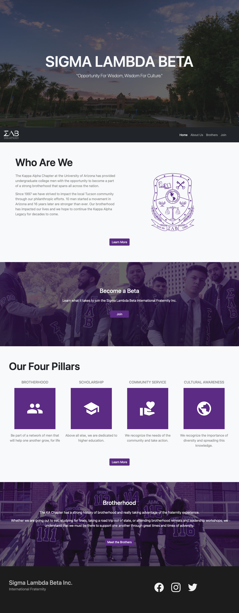

# Sigma Lambda Beta Website

Website for the Sigma Lambda Beta International Fraternity at the U of A. The website was designed to highlight mission statement, leadership, members, and to facilitate the on-boarding process for potential new members.

## Feature Highlights
- Layout designed using Bootstrap V5
    - fully responsive to  large and small screen sizes
- Entirely custom photographs
- Followed existing design and interface guidlines for Sigma Lambda Beta Inc.

*Screenshot of desktop View*

*Screenshot of mobile View*

